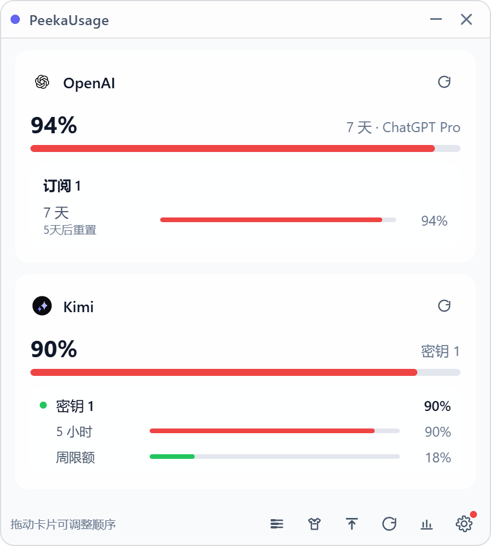
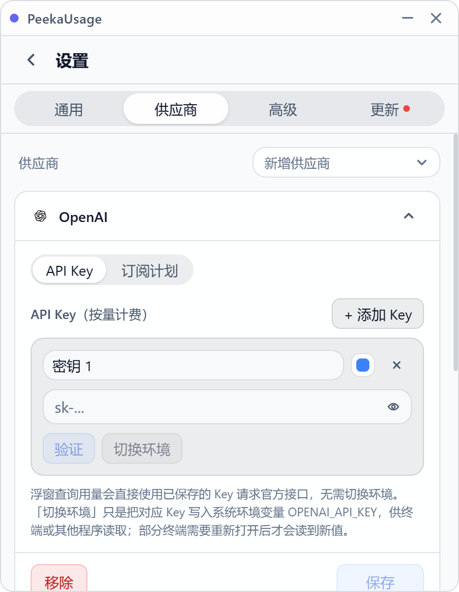

<p align="center">
  
</p>

<h1 align="center">PeekaUsage</h1>

<p align="center">
  常驻桌面角落的 AI 用量监控浮窗：订阅配额、Coding Plan 限额、API 余额，一眼扫到。
</p>

<p align="center">
  <a href="https://github.com/yaoliwen542-sketch/PeekaUsage/releases/latest"></a>
  <a href="https://github.com/yaoliwen542-sketch/PeekaUsage/blob/main/LICENSE"></a>
  
  
</p>

<p align="center">
  <a href="./README.en.md">English README</a>
</p>

---

如果你同时挂着 Claude Code、Codex、Kimi Code 好几个 AI 编程工具，大概熟悉这种日常：

- 跑一会儿就想知道配额还剩多少，反复敲 `/usage`、切 Dashboard
- 5 小时窗口、周限额、余额、速率限制分散在各家页面里
- 等发现打满时，任务已经卡了半天

PeekaUsage 干的事情很简单：**把这些数字钉在桌面上，变成不用点开就能看到的呼吸灯。**

它不是模型平台，不是代理层，不碰你的请求流量——只用你保存的 Key 直接请求各家官方接口，把结果画成进度条。

## 界面一览

<p align="center">
  
</p>

<p align="center">
  <em>主浮窗：OpenAI 订阅窗口、Kimi 的 5 小时窗口与周限额，逐窗口独立显示</em>
</p>

<p align="center">
  
</p>

<p align="center">
  <em>灵动岛：悬浮在屏幕顶部的迷你状态条，鼠标移入展开详情与快捷设置</em>
</p>

<p align="center">
  
</p>

<p align="center">
  <em>设置页：多 Key 管理、OAuth 自动检测、一键切换系统环境变量</em>
</p>

## 支持的供应商

| 类型 | 供应商 | 展示内容 |
| --- | --- | --- |
| 订阅窗口 | OpenAI | 5 小时 / 7 天等订阅窗口利用率与重置时间 |
| 订阅窗口 | Anthropic | 5 小时 / 7 天 / 7 天 Sonnet / 7 天 Opus 窗口、Extra Usage |
| 订阅窗口 | Gemini | OAuth 订阅用量 |
| Coding Plan | Kimi / GLM / MiniMax / 火山方舟 | 5 小时窗口 + 周限额分窗口利用率 |
| 余额 | OpenRouter / DeepSeek / SiliconFlow / StepFun / Novita AI | 余额与用量 |
| 自定义 | 任意供应商 | 脚本化查询（余额类），自定义名称、环境变量与查询逻辑 |

凭据管理方式：

- **OAuth 自动检测**：自动读取本地 Claude Code / Codex CLI 凭据（含多账号 `account_id`），也提供官方获取入口
- **多 Key 管理**：每个供应商可保存多个命名 Key，支持验证、单独刷新
- **环境变量切换**：一键把指定 Key 写入系统环境变量（`OPENAI_API_KEY` / `ANTHROPIC_API_KEY` 等），供终端工具使用——浮窗查询本身始终直连官方接口，不依赖环境变量

## 功能特性

**监控展示**

- 订阅窗口、Coding Plan 限额、余额统一成进度条卡片，利用率按绿 / 黄 / 红分级
- 详细 / 精简两种显示模式，精简模式保留全部分窗口进度条
- 卡片拖拽排序，顺序持久化
- 使用统计面板，回顾历史消耗

**灵动岛**

- 屏幕顶部常驻迷你状态条，轮播各供应商当前利用率
- 鼠标移入展开详情面板与快捷设置，移出自动收起

**刷新策略**

- 全局自动刷新（秒 / 分钟自定义）或仅手动
- 可按供应商设置独立刷新策略
- 主界面整页刷新、单卡刷新、托盘刷新

**桌面体验**

- 浅色 / 深色 / 跟随系统主题，窗口透明度调节
- 始终置顶；拖到屏幕边缘自动吸附成细条，鼠标移入展开
- 窗口大小随内容自动调整；开机自启；系统托盘
- 简体中文 / 繁体中文 / English 即时切换

**应用内更新**

- 设置页内置更新分区：检查更新、查看 Release 说明、一键安装
- 支持启动时自动检查与定时检查

## 下载与安装

前往 [GitHub Releases](https://github.com/yaoliwen542-sketch/PeekaUsage/releases/latest) 下载对应平台安装包：

| 平台 | 产物 |
| --- | --- |
| Windows | NSIS 安装包（`x64`） |
| Linux | `.deb` / `.AppImage`（`x86_64`） |
| macOS | `.dmg` / `.app`（`x86_64` 与 `arm64`） |

**macOS 说明**：当前产物未签名、未 notarize。如果首次打开提示「文件已损坏，无法打开」，执行：

```bash
xattr -dr com.apple.quarantine /Applications/PeekaUsage.app
```

## 快速上手

1. 打开设置页（主界面右下角齿轮），切到「供应商」
2. 「新增供应商」选择要监控的供应商
3. 订阅类供应商（OpenAI / Anthropic / Gemini）点「自动检测」读取本地凭据，或按「获取方式」前往官方文档获取；用量 / 余额类供应商直接粘贴 API Key
4. 保存后回到主界面，用量会自动出现在卡片上

## 本地开发

```bash
npm install          # 安装依赖
npm run dev          # 前端开发服务器
npm run tauri dev    # 启动桌面应用
```

Linux 开发 / 打包需要额外依赖：

```bash
sudo apt-get update
sudo apt-get install -y build-essential curl file libfuse2 libgtk-3-dev libssl-dev libwebkit2gtk-4.1-dev libayatana-appindicator3-dev librsvg2-dev patchelf
```

基本检查：

```bash
npx tsc --noEmit
cargo fmt --all --check
cargo check --manifest-path src-tauri/Cargo.toml
```

平台打包：

```bash
npm run tauri:build:linux   # Linux（目标见 src-tauri/tauri.linux.conf.json）
npm run tauri:build:macos   # macOS（目标见 src-tauri/tauri.macos.conf.json）
```

## 项目结构

```text
src/                    # React 前端
  components/widget/    # 主浮窗卡片、拖拽排序
  components/island/    # 灵动岛
  components/settings/  # 设置页（供应商、通用、高级、更新）
  i18n/                 # 多语言文案与窗口标签映射
  stores/               # provider / settings / update 状态

src-tauri/src/
  providers/            # 供应商查询（订阅 / CodingPlan / 余额 / 脚本）
  commands/             # Tauri 命令（配置、用量、窗口、更新）
  config/               # 配置持久化、凭据存储、系统环境变量
  tray/                 # 系统托盘
```

## 为什么还没有支持所有供应商

有些供应商没有公开、稳定、可维护的官方用量接口；也有一部分原因是作者精力有限，社畜下班后体力条见底。

欢迎提 Issue / PR 接入新 provider，比较理想的贡献包括：

- Rust 侧 provider 实现与类型定义
- 前端展示与设置项
- 对应文档、环境变量、图标资源和验证步骤

只要数据来源可靠、行为边界清楚、不会把现有交互搞坏，就很欢迎一起补。

## License

[MIT](./LICENSE)
